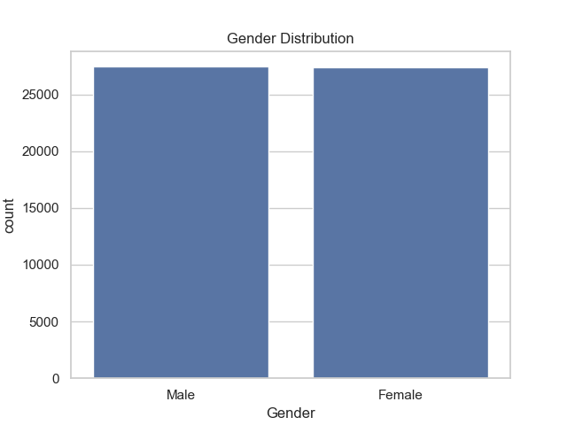
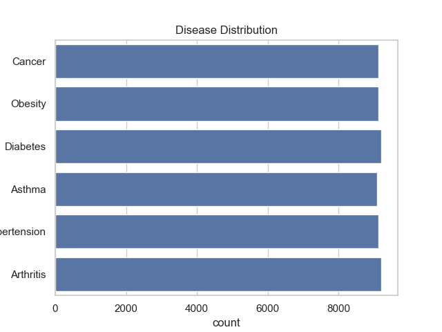
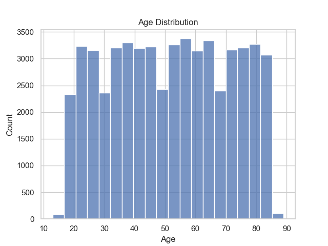
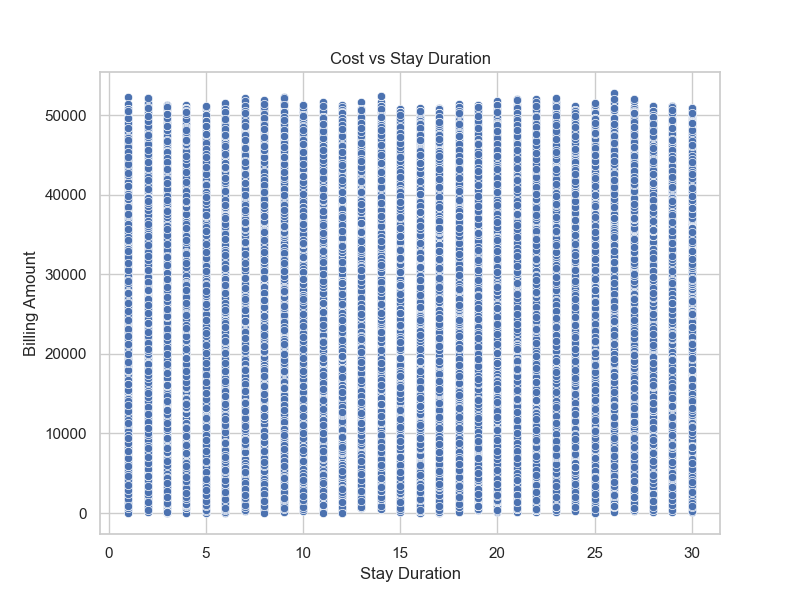

# 🏥 Healthcare Data Analysis: Patient Risk & Cost Insights

## 📌 Project Overview

This project analyzes healthcare patient data to uncover insights related to patient risk, disease distribution, and treatment costs.

The goal is to help hospitals make better decisions using data.

---

## 🛠️ Tools & Technologies Used

* Python
* Pandas
* Matplotlib
* Seaborn

---

## 📂 Project Structure

* data/ → dataset used for analysis
* src/ → Python scripts
* images/ → visualizations
* README.md → project documentation

---

## 🔍 Key Analysis Performed

* Data Cleaning (duplicates removal, fixing data types)
* Feature Engineering (Stay Duration calculation)
* Exploratory Data Analysis (EDA)
* Advanced Analysis (risk identification, cost analysis)

---

## 📊 Key Insights

### 1. Gender Distribution

Male and Female patients are almost equally distributed.

### 2. Disease Distribution

All diseases appear in similar proportions, making the dataset balanced.

### 3. Most Common Diseases

Arthritis, Diabetes, and Hypertension are the most frequent.

### 4. Admission Type

Elective, Urgent, and Emergency admissions are evenly distributed.

### 5. Age vs Disease

Older patients tend to have more chronic conditions.

### 6. Cost vs Stay Duration

Longer hospital stays result in higher billing amounts.

### 7. High-Risk Patients

Patients above 60 years with long hospital stays are high-risk.

### 8. Costly Diseases

Certain diseases lead to higher average treatment costs.

### 9. Data Quality Insight

Initial data contained duplicates and invalid values, highlighting the importance of data cleaning.

### 10. Business Impact

This analysis can help hospitals:

* Improve patient care
* Optimize costs
* Manage resources efficiently

---

## 🚀 Conclusion

This project demonstrates how data analysis can be used to extract meaningful insights from healthcare data and support better decision-making.

---

## 📊 Visualizations

